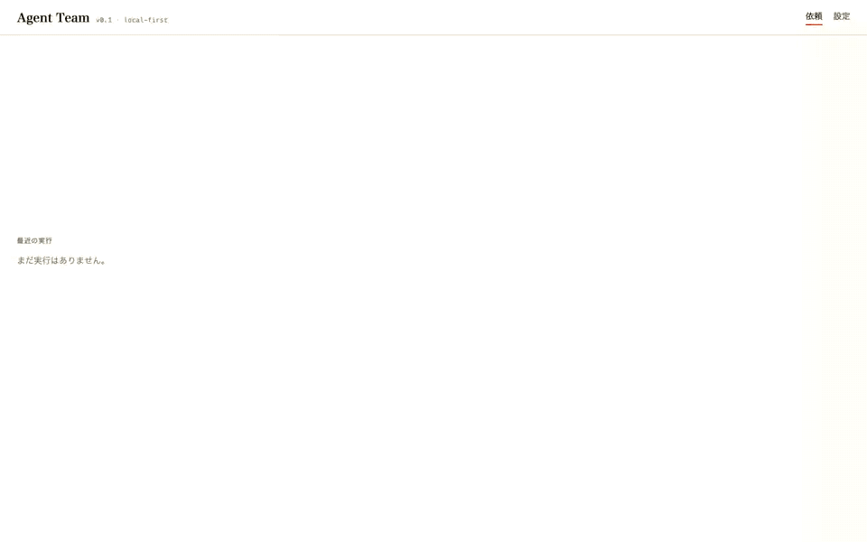

<p align="center">
  
</p>

<h1 align="center">Agent Team</h1>
<p align="center"><strong>An open-source AI team that ships real work — with a conversation you can follow.</strong></p>

<p align="center">
  <a href="https://github.com/FORIFOR/Multibot/actions/workflows/ci.yml"></a>
  <a href="LICENSE"></a>
  
  
  <a href="https://forifor.github.io/Multibot/"></a>
</p>

<p align="center"><a href="https://forifor.github.io/Multibot/">Website &amp; 58s narrated intro</a> · <a href="#quickstart">Quickstart</a> · <a href="#how-it-works">How it works</a> · <a href="docs/STATUS.md">What's verified</a> · <a href="#日本語">日本語</a></p>

> [▶ Narrated intro video (58s, Japanese)](https://forifor.github.io/Multibot/media/intro.mp4). The GIF above drives the real UI and runtime with the **scripted test provider** (no LLM calls, labelled “FAKE PROVIDER” on screen) so it is deterministic and free to reproduce. With a real connection the same screens are fed by live model calls; the run header shows the model the provider actually reported and the measured cost.

You type **one request**. A Master plans the deliverables, a Researcher, a Builder and a Reviewer actually do the work, and you get the files **plus** the real bot-to-bot messages, a timeline, and verification bound to each artifact revision.

- **No scripted chat.** The chat panel is a projection of `message.sent` events — messages that were really delivered to another bot's mailbox. A question wakes the other bot to answer.
- **Evidence, not vibes.** Checks and review verdicts are events bound to an artifact revision hash. The final report is compiled from the event log; a model summary cannot upgrade “started” to “done”.
- **Runtime-enforced limits.** Tool scope, write scope, budget reservation, approvals and cancellation are enforced in code, not by prompt wording.
- **Per-bot configuration.** Each bot inherits a default connection and model and can override endpoint, model, effort and system prompt (lockable). Configured vs. provider-reported model are both shown. No silent fallbacks.
- **Replay, resume, fork, export.** Replay never calls a model. Fork from a checkpoint with a different model for one bot and compare. Export the whole run as JSONL.

## Quickstart

```bash
git clone https://github.com/FORIFOR/Multibot && cd Multibot
cd backend && uv venv .venv --python 3.12 && uv pip install --python .venv/bin/python -e '.[dev]'
cd ../frontend && pnpm install && pnpm build && cd ../backend
export ANTHROPIC_API_KEY=sk-ant-...        # the config stores a reference (env:ANTHROPIC_API_KEY), never the value
.venv/bin/agentteam serve                  # http://127.0.0.1:8787
```

First run: open **Settings → Probe**. It makes one tiny real call to confirm tool calling and JSON-schema output on the model you picked, then unlocks Start. Placeholder models, unknown prices and unverified connections refuse to start with a structured reason.

Works with Claude (official SDK, default `claude-opus-5`), any OpenAI-compatible chat endpoint, and local Ollama (`driver: ollama`, `http://localhost:11434/v1`).

CLI:

```bash
.venv/bin/agentteam validate                        # config check
.venv/bin/agentteam probe [connection] --model ID   # real capability probe
.venv/bin/agentteam run "Turn this into a launch page and 3 posts" --url https://example.com --budget 1.5
```

## How it works

| Component | Responsibility |
| --- | --- |
| **Master (planner)** | Request → deliverables, recorded assumptions, task DAG (structured output). The runtime validates schema, cycles, owners, tools, write scopes and limits; invalid plans are sent back once, then the run fails honestly. |
| **AgentRunner** | One bot session = its own conversation state + a tool loop through the gateway. A worker receives its task, input artifact refs and its own inbox — not the whole history. |
| **MessageBus** | `send_message` really delivers to the recipient's mailbox and records `message.sent`. Purposes are limited to request / question / answer / handoff / finding / decision. |
| **ArtifactStore** | `publish_artifact` creates an immutable, SHA-256-hashed revision with an atomic write. Reviews and checks bind to a revision. |
| **Scheduler** | Dependency resolution, concurrency limit, review fail → revise → re-review (bounded), Master exception decisions, checkpoints. |
| **PolicyEngine** | Budget = spent + reserved for in-flight calls; call/tool/message limits; tool and path scope; cancellation. Unknown cloud prices are never treated as free. |
| **Sandbox** | macOS `sandbox-exec` (no network, writes only inside the task workspace). Elsewhere a plain subprocess that says so in every result. |

Everything is written to an append-only event store (SQLite WAL, per-run `seq`, UTC timestamps, redaction before persistence). Chat, timeline and report are projections of it. The event types are the blueprint's 11 plus runtime extensions, all validated against [`backend/schemas/event.schema.json`](backend/schemas/event.schema.json).

```
backend/agentteam/
  contracts.py    TeamPlan · Task · Event · Message · Artifact · Approval · Run
  config/         YAML + JSON Schema · secret references (env: / keychain: / file:)
  store/          EventStore · ArtifactStore · RunStore
  providers/      anthropic_messages (official SDK) · openai_compatible_chat / ollama (httpx) · fake (tests only)
  runtime/        PolicyEngine · MessageBus · ToolGateway · Sandbox · Checks · Web tools · AgentRunner · Planner · Scheduler · RunManager
  api/            REST + SSE + static UI
frontend/         React + TypeScript (request · run · settings)
docs/             website, blueprint (spec, security, references), status
evals/            40-case acceptance plan and coverage map
```

## What is verified — and what isn't

- **36 deterministic tests** (`cd backend && .venv/bin/python -m pytest -q`): DAG validation, real delivery with a question/answer round trip, review → revise → re-review, budget reservation, approvals with hash/nonce, cancel → resume, fork, redaction, SSRF guard, sandbox write confinement, SSE cursor replay, event-schema conformance.
- **Headless-Chrome UI smoke** with zero console errors (`frontend/scripts/ui-smoke.mjs`).
- **Not yet run:** end-to-end runs with a real model were not executed in the build environment (no API key there). `backend/scripts/smoke_real_llm.py` performs the probe plus a three-role run and prints the evidence (models reported, usage, artifacts, checks, messages). Prompts are original seeds, not benchmark-optimised.

Full matrix: [`docs/STATUS.md`](docs/STATUS.md). Security boundaries: [`SECURITY.md`](SECURITY.md).

## Design notes

The product was built from a written blueprint ([`docs/blueprint/`](docs/blueprint/)): spec, implementation brief, security requirements, references, and 40 acceptance cases. Deliberate deviations (no Deep Agents/LangGraph dependency, extended event enum, refusal fallback off by default) are recorded in [`docs/IMPLEMENTATION_PLAN.md`](docs/IMPLEMENTATION_PLAN.md). Contributions: [`CONTRIBUTING.md`](CONTRIBUTING.md).

## 日本語

**依頼は一度。AI チームが作り、確かめ、成果物と経緯を残す。**

Master が成果物と完了条件を決め、必要な Bot（Researcher / Builder / Reviewer）だけが実際に作業します。成果物、Bot 間の実メッセージ、時系列、最終報告は同じ実行記録（append-only Event Store）から表示され、台本の会話や固定の成功ログは使いません。

- 成果物を開くと、誰が作り、何を引き継ぎ、どの検証を通ったかまで辿れる
- 各 Bot の接続先・モデル・システムプロンプトを個別に上書きできる（共通設定を継承、手動固定あり）
- 停止・再開・分岐（Bot のモデルを変えて別案）・再生（LLM 呼出なし）・JSONL エクスポート
- 権限・予算・回数上限・承認はプロンプトではなく Runtime が強制

上の GIF はテスト用のスクリプト provider（LLM 呼出なし、画面に「FAKE PROVIDER」と表示）で実 UI と実 Runtime を動かしたものです。実 LLM での協働は、この版の作成環境に API キーが無かったため未検証です（`backend/scripts/smoke_real_llm.py` で確認できます）。詳細は [`docs/STATUS.md`](docs/STATUS.md)。

## License

MIT. Bundled prompts and skills are original to this project (see `docs/blueprint/REFERENCES.md`).
