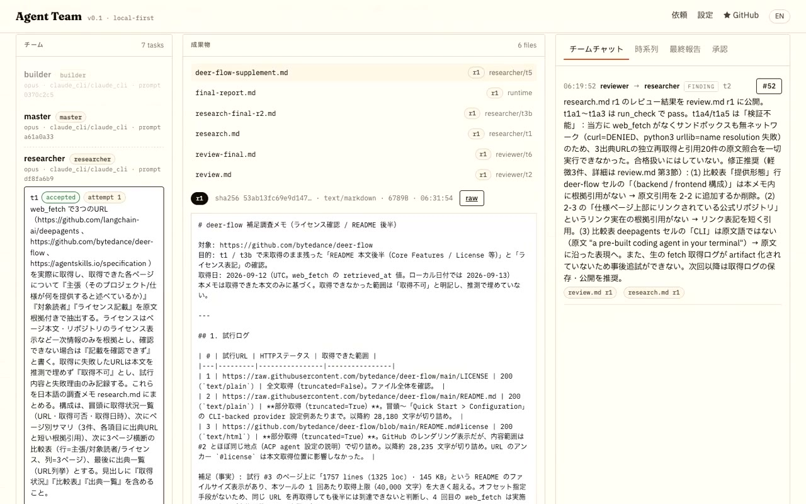

<p align="center">
  
</p>

<h1 align="center">Agent Team</h1>
<p align="center"><strong>One request. The deliverable, and how it was checked.</strong><br />An AI team drafts, reviews and revises the work, and keeps who checked what next to the deliverable.</p>
<p align="center"><sub>Product name: <strong>Agent Team</strong> · repository: <strong>FORIFOR/Multibot</strong> · MIT</sub></p>

<p align="center">
  <a href="https://github.com/FORIFOR/Multibot/actions/workflows/ci.yml"></a>
  <a href="LICENSE"></a>
  
  
  <a href="https://forifor.github.io/Multibot/"></a>
</p>

<p align="center"><a href="https://forifor.github.io/Multibot/">Website: a real work record you can click through</a> · <a href="https://reachmade.com/products/#agent-team">Reachmade Lab product page</a> · <a href="#quickstart">Quickstart</a> · <a href="#how-it-works">How it works</a> · <a href="docs/STATUS.md">What's verified</a> · <a href="#日本語">日本語</a></p>

> **A real run, on the site:** [forifor.github.io/Multibot](https://forifor.github.io/Multibot/) shows the record of a real `claude-opus-5` run — request → first draft → three review findings → the changed passages → re-verification — where clicking a finding jumps to the changed part of the deliverable, plus a 29-second replay of the same run. Files: [`docs/evidence/scenarios/research2/`](docs/evidence/scenarios/research2/).
>
> [▶ 実モデルの作業記録・日本語解説（32秒）](https://forifor.github.io/Multibot/media/real-walkthrough-ja.mp4). Edited replay of a real run, with synthesized Japanese narration. The run ended **partial**, with the unfinished source check disclosed. No scripted provider is used in this video.
>
> **Benchmark audit (2026-09-14, updated):** latest attempts across 50 tasks × 3 repetitions: team 69 completed / 5 partial / 76 failed; single agent 150 completed. The team has 79 provider-blocked pairs. All 252 team attempts remain accounted for, including earlier failures. These are constructed evaluation inputs, not customer workflows; no team quality advantage is established. [Metrics and Reviewer audit](docs/evidence/readiness-2026-09-14/README.md).
>
> **Production work:** Authenticated dedicated deployments now include role checks, per-run access, audit records and offline backup/restore. SSO, distributed recovery and production acceptance remain in progress. [Controls and deployment](docs/PRODUCTION.md) · [Acceptance plan](docs/PRODUCTION_PLAN.md).

> **Local evaluation:** Ollama trials exposed review, tool-recovery, source-input, artifact-ownership and completion-state bugs. The current checkout passes **107 deterministic tests (1 skipped)**. The legacy 300-run comparison is preserved and stopped because its inputs contain fictional products and synthetic business data; it is not acceptance evidence. The fixed-series test using the actual repository documents and a local Qwen model was stopped after two v18 runs exposed translation drift. A v20 retry with explicit repair examples still failed its first current-contract check, so no local run is counted as accepted. [Fixes](docs/evidence/local-fixes-2026-09-14/README.md) · [v18 evidence](docs/evidence/real-readiness-v18-qwen35-fixed-2026-09-15/README.md) · [v20 evidence](docs/evidence/real-readiness-v20-qwen35-fixed-2026-09-15/README.md).
>
> **Enterprise readiness:** demonstration material is available, but the required ten repeated runs of one workflow are not yet verified. The latest local-Qwen retry failed the current delivery contract on its first run. L2 customer-data PoC and L3 production readiness are not claimed. [L1 / L2 / L3 acceptance criteria](docs/ENTERPRISE_READINESS.md).

You type **one request**. Attach the source files the team should use, then a Master plans the deliverables, a Researcher, a Builder and a Reviewer actually do the work. You get the files **plus** the real bot-to-bot messages, a timeline, and verification bound to each artifact revision. While a run is active, a human direction is recorded as an event and handed to the next task session; the existing plan is not silently rewritten.

- **No scripted chat.** The chat panel is a projection of `message.sent` events — messages that were really delivered to another bot's mailbox. A question wakes the other bot to answer.
- **Evidence, not vibes.** Checks and review verdicts are events bound to an artifact revision hash. The final report is compiled from the event log; a model summary cannot upgrade “started” to “done”.
- **Runtime-enforced limits.** Tool scope, write scope, budget reservation, approvals and cancellation are enforced in code, not by prompt wording.
- **Per-bot configuration.** Each bot inherits a default connection and model and can override endpoint, model, effort and system prompt (lockable). Configured vs. provider-reported model are both shown. No silent fallbacks.
- **Replay, resume, fork, export.** Replay never calls a model. Fork from a checkpoint with a different model for one bot and compare. Export the whole run as JSONL.
- **Real inputs and handoff.** Attach `.txt`, `.md` or `.csv` material (up to 512KB per file in the UI). Send a change, question or edit from the team chat and keep the received direction in the run timeline.

## Quickstart

[Workplace benchmark: measured local pilot, failures, and remaining enterprise gates](docs/WORKPLACE_BENCHMARK.md).

One command if you have [Claude Code](https://claude.com/claude-code) installed and logged in (no API key), plus [uv](https://docs.astral.sh/uv/):

```bash
uvx --from "git+https://github.com/FORIFOR/Multibot#subdirectory=backend" agentteam quickstart
```

`quickstart` makes one small real call through `claude -p` to confirm tool calling and JSON-schema output, then serves the UI at http://127.0.0.1:8787 and opens it. From a checkout:

```bash
git clone https://github.com/FORIFOR/Multibot && cd Multibot/backend
uv venv .venv --python 3.12 && uv pip install --python .venv/bin/python -e '.[dev]'
.venv/bin/agentteam quickstart          # the built UI ships inside the package; `cd ../frontend && pnpm build` only if you change it
```

Other providers: set `defaults.connection_id` in `data/agents.yaml` (or in Settings) to `anthropic` with `ANTHROPIC_API_KEY`, to an OpenAI-compatible endpoint (verified live with `gpt-4.1-mini`), or to local Ollama (`driver: ollama`, `http://localhost:11434/v1`). Every connection must pass the probe before a run can start; placeholder models and unknown prices refuse to start with a structured reason.

**Sandbox.** Builder/Reviewer commands run in Docker when a daemon answers (`--network none`, read-only root, host uid, CPU/memory/pid limits; Docker Desktop, Colima or any engine), otherwise in the macOS seatbelt; with neither, commands are refused rather than run unsandboxed (set `AGENTTEAM_SANDBOX=subprocess` to opt out knowingly).

**Language.** The app UI has an EN/JA toggle in the header (defaults to your browser language).

## How it works

| Component | Responsibility |
| --- | --- |
| **Master (planner)** | Request → deliverables, recorded assumptions, task DAG (structured output). The runtime validates schema, cycles, owners, tools, write scopes and limits; invalid plans get up to two retries, then the run fails with a recorded reason. |
| **AgentRunner** | One bot session = its own conversation state + a tool loop through the gateway. A worker receives its task, input artifact refs and its own inbox — not the whole history. |
| **MessageBus** | `send_message` really delivers to the recipient's mailbox and records `message.sent`. Purposes are limited to request / question / answer / handoff / finding / decision. |
| **ArtifactStore** | `publish_artifact` creates an immutable, SHA-256-hashed revision with an atomic write. Reviews and checks bind to a revision. |
| **Scheduler** | Dependency resolution, concurrency limit, review fail → revise → re-review (bounded), Master exception decisions, checkpoints, and bounded **milestone replanning**: when the DAG finishes, the Master may add tasks if the goal is not met (`max_replans`). |
| **PolicyEngine** | Budget = spent + reserved for in-flight calls; call/tool/message limits; tool and path scope; cancellation. Unknown cloud prices are never treated as free. |
| **Sandbox** | Docker (`--network none`, read-only root, host uid, resource limits) or macOS `sandbox-exec`; with neither available commands are refused, never silently unsandboxed. Every result records which backend ran. |
| **Providers** | `claude_cli` (local Claude Code, no key), `anthropic_messages` (official SDK), `openai_compatible_chat`, `ollama`. Per-bot choice; real probe before start. |

Everything is written to an append-only event store (SQLite WAL, per-run `seq`, UTC timestamps, redaction before persistence). Chat, timeline and report are projections of it. The event types are the blueprint's 11 plus runtime extensions, all validated against [`backend/agentteam/schemas/event.schema.json`](backend/agentteam/schemas/event.schema.json).

```
backend/agentteam/
  contracts.py    TeamPlan · Task · Event · Message · Artifact · Approval · Run
  config/         YAML + JSON Schema · secret references (env: / keychain: / file:)
  store/          EventStore · ArtifactStore · RunStore
  providers/      anthropic_messages (official SDK) · openai_compatible_chat / ollama (httpx) · fake (tests only)
  runtime/        PolicyEngine · MessageBus · ToolGateway · Sandbox · Checks · Web tools · AgentRunner · Planner · Scheduler · RunManager
  api/            REST + SSE + static UI
frontend/         React + TypeScript (request · run · settings)
docs/             website, blueprint (spec, security, references), status
evals/            40-case acceptance plan and coverage map
```

## What is verified — and what isn't

Real runs through the local Claude Code CLI (`claude-opus-5`, provider-reported). Artifacts, reports and full event logs are committed unedited under [`docs/evidence/`](docs/evidence/).

**Reproducibility, 2026-09-13 afternoon — the same four requests, three runs each, nothing filtered** ([`docs/evidence/scenarios/rerun-2026-09-13/`](docs/evidence/scenarios/rerun-2026-09-13/), budget $6 and 120 model calls per run):

| Request | Completed | Plan size | Review pass | Cost / run | Time / run |
| --- | --- | --- | --- | --- | --- |
| CLI tool in Python with unittest + README | **3 / 3** | 2 tasks every time | 22/22 | $2.09–3.14 | 16–19 min |
| 4-file static docs site | **3 / 3** | 2 tasks every time | 22/22 | $1.62–1.72 | 15–17 min |
| Launch page + 3 post drafts | **2 / 3** | 2 (one run grew to 6) | 38/39 | $1.70–5.67 | 20–37 min |
| Source-grounded comparison of 3 web pages | **0 / 3** (all *partial*) | 4–5 | 21/24 | $5.48–6.11 | 31–35 min |

I re-ran the generated unit tests myself for all three code runs (18 / 19 / 17 tests, OK) and checked the three generated sites for broken internal links (none). The launch-page run that ended *partial* had both planned tasks accepted at $1.29; the Master then added two rounds of wording polish and the last task hit the model-call limit. All three research runs had their planned `research.md` accepted, then ended *partial* for one structural reason: the default reviewer had no `web_fetch`, so it could not check claims against their sources as the request asked, and the Master's workaround tasks exhausted the budget. Both are fixed after this evaluation (reviewer gets `web_fetch`; a milestone replan is skipped and recorded when less than one agent session of budget or model calls remains; the Master is told not to add polish once every deliverable is accepted; partial runs carry a reason). The fixes are covered by deterministic tests; one post-fix research run **completed** (reviewer fetched all three sources, 5/5 review pass, $2.05, 8m44s, [`research-postfix/`](docs/evidence/scenarios/rerun-2026-09-13/research-postfix/)) — one run, not a new 3-run series.

Earlier single runs (v0.2.0, 2026-09-13 morning): launch page completed ($1.66, 18 min); code completed ($1.87, 16 min); research failed on a scheduler deadlock, then *partial* after the fix ($6.07, 24 min); docs site completed ($3.03, 15 min). Other providers on the launch-page request: OpenAI-compatible `gpt-4.1-mini` completed in 29 s for $0.02; local Ollama `qwen2.5:7b` reached *partial*; `qwen2.5:3b` could not produce a valid plan.

Also verified: **107 deterministic tests, 1 skipped** (DAG validation, real delivery with a question/answer round trip, review → revise → re-review, milestone replanning and its budget gate, budget reservation, approvals with hash/nonce, cancel → resume, fork, redaction, SSRF guard, Docker and seatbelt sandbox confinement, SSE cursor replay, event-schema conformance), and in CI on every push: the Docker isolation test on Linux and a headless-Chrome UI smoke of the bundled UI in English and Japanese (start a request → run view → final report → settings, exits non-zero on any error).

Still open: three runs per request is a record, not a benchmark; plans vary because the Master decides; research-heavy requests are the most expensive (about $6 at list price) and the least reliable; local 7B models complete the mechanics but not the review protocol; no one outside the author has used it yet. Full matrix and the list of bugs found by real runs: [`docs/STATUS.md`](docs/STATUS.md). Security boundaries: [`SECURITY.md`](SECURITY.md).

## Read more

- [dev.to: I built an AI team that ships real work — and shows you the conversation](https://dev.to/forifor/i-built-an-ai-team-that-ships-real-work-and-shows-you-the-conversation-251a)
- [Zenn（日本語）: Claude Codeで調査・レビュー・修正を回すOSSを作った。3件直っても「未完了」だった](https://zenn.dev/forifori/articles/agent-team-launch)
- Launch threads on X: [English](https://x.com/i/status/2098800226199130220) · [日本語](https://x.com/i/status/2098800307421716835)

## Design notes

The product was built from a written blueprint ([`docs/blueprint/`](docs/blueprint/)): spec, implementation brief, security requirements, references, and 40 acceptance cases. Deliberate deviations (no Deep Agents/LangGraph dependency, extended event enum, refusal fallback off by default) are recorded in [`docs/IMPLEMENTATION_PLAN.md`](docs/IMPLEMENTATION_PLAN.md). Contributions: [`CONTRIBUTING.md`](CONTRIBUTING.md). Changes by version: [`CHANGELOG.md`](CHANGELOG.md).

## 日本語

**依頼は一度。成果物も、検証の経緯も。** AI チームが作成・レビュー・修正を進め、誰が何を確かめたかまで、成果物と一緒に残します。（製品名 Agent Team、リポジトリ FORIFOR/Multibot、MIT）

Master が成果物と完了条件を決め、必要な Bot（Researcher / Builder / Reviewer）だけが実際に作業します。成果物、Bot 間の実メッセージ、時系列、最終報告は同じ実行記録（append-only Event Store）から表示され、台本の会話や固定の成功ログは使いません。

- 成果物を開くと、誰が作り、何を引き継ぎ、どの検証を通ったかまで辿れる
- 成果物の版間差分を確認して採用版を明示でき、成果物・最終報告・イベントログを run 単位の ZIP で取得できる
- 各 Bot の接続先・モデル・システムプロンプトを個別に上書きできる（共通設定を継承、手動固定あり）
- 停止・再開・分岐（Bot のモデルを変えて別案）・再生（LLM 呼出なし）・JSONL エクスポート
- 権限・予算・回数上限・承認はプロンプトではなく Runtime が強制

上の画像と32秒の映像は実モデルの実行記録です。映像は記録の再生を編集し、日本語合成音声を付けています。この実行は予算上限で部分完了し、未検証の出典照合を明示しています。企業紹介用のデモ・導入設計相談は可能ですが、有償PoCや本番運用への適合は別途検証が必要です。

## Third-party

- The "thinking" orb in the app header is a standalone export of the [Liquid Orb Editor](https://github.com/LerSent001/orb) (MIT, © 2026 LerSent001), vendored under `frontend/src/assets/` with its license and parameter snapshot.

## License

MIT. Bundled prompts and skills are original to this project (see `docs/blueprint/REFERENCES.md`).
