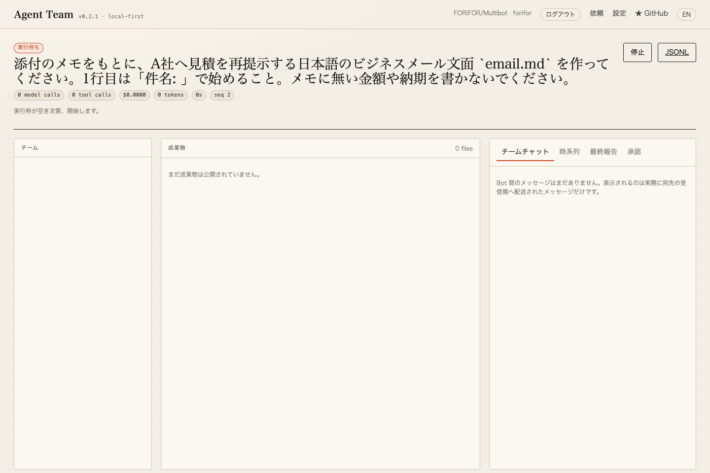

# Durable execution evidence — 2026-09-14

Status: dedicated-host delivery controls verified locally. **L3 is not attained.** These are interruption/recovery drills, not successful business work.

- Backend suite: **87 passed**, including five new real SQLite/process/HTTP tests. Existing legacy fake-provider tests remain; none were added for this work.
- Actual Qwen3.5 9B local inference: **four delivery checks passed**. A real accepted request was replayed with the same key and did not create another job; cancelling a queued request called no model; SIGKILL left active work interrupted while the previously unstarted queued request ran after restart; active cancellation did not claim completion.
- Actual Chrome/API/SSE: **two checks passed**, zero browser JavaScript errors. A real workplace request showed the waiting state and was cancelled before its model call. Request source came from the original saved workplace workflow; no synthetic success input/output was substituted.
- SQLite checks use competing real database connections, real generated owner credentials and an actual child process exiting without cleanup. A restored snapshot cannot automatically replay its queued jobs. HTTP idempotency was also checked across restart and user boundaries.

Machine-readable evidence: [real-model delivery](durable-local.json), [real browser](durable-browser.json). The model profile came from the separately frozen 9B benchmark's actually probed configuration. The 300-comparison series was paused while this resource-intensive drill ran; none of these drills are inserted into its results.

Real drill runs in the delivery record intentionally end interrupted/cancelled. `execution_jobs.state = finished` means the delivery wrapper ended, not that the business task succeeded. The screenshot shows an actual queued request with zero model/tool calls; it is not a staged chat or fabricated completion.

Scope limits: one process/host/organization, SQLite on local disk, no HA, no distributed lease takeover, no exactly-once external side-effect guarantee. Independent security/load/availability acceptance and business-quality validation remain open. See [operating semantics](../../DURABLE_EXECUTION.md).
