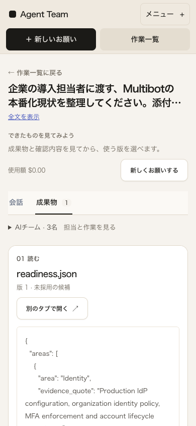
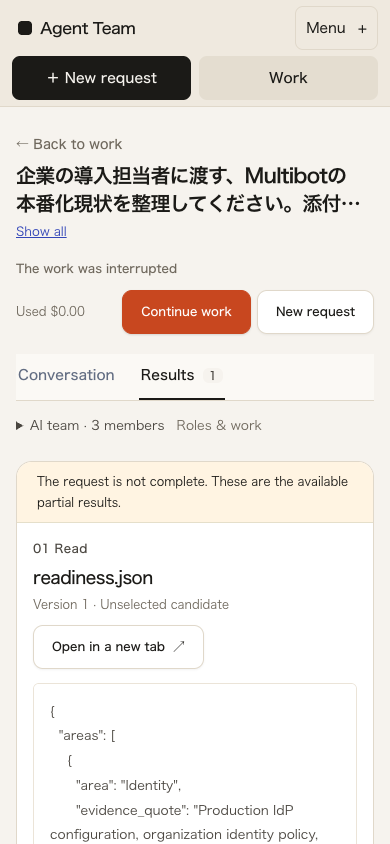
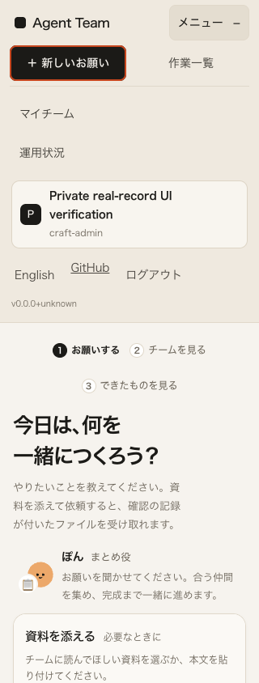

# 小画面でも作業の移動を見つけられるメニュー

2026-10-02。[品質目標](../../design/AWARD_QUALITY.md)に沿い、前回の独立批評で残った小画面の3段ナビゲーションを改善した。**受賞水準・一般公開・人間受入・一般業務品質・L3は未達。** 保存した実v62を読むUIの確認であり、新しい生成試験ではない。

## 変更と同条件の比較

新しいお願いと作業一覧を常設し、重複していたお願いへのリンクを統合した。言語・主体・ログアウトと管理者用の操作は、同じDOMの開閉メニューへまとめた。実際のロール制限、確認待ちの件数、未完了注記、成果物・下書き・主体の分離は維持する。Escapeでメニューボタンへ戻り、移動・履歴移動・外側のクリックで閉じる。デスクトップでは従来どおり各操作を常設する。

基準は `a3258b52a3d8f6f2da0c14186b3491a2b5996f71`。変更後の実測対象は未commit差分を含む [ソースhash](after-r1-source.json) と配信bundleである。同じ未採用の実記録を別SQLiteへ取り込み、日英×320/390/768/1440幅×completed/failed/interruptedの24条件を前後撮影した。viewport高844px・scrollY=0。[前](baseline/report.json) / [後](after-r1/report.json) / [比較](comparison.json)。

| 同じ未採用rep3 | メニュー高・前→後 | 本文枠上端・前→後 |
| --- | ---: | ---: |
| 日本語390幅 | 153→107px | 693.39→647.39px |
| 日本語320幅 | 153→107px | 717.02→671.02px |

文字を縮小せず、主要2操作を44pxの行にした。24条件で横overflow・page errorは観測せず、状態・警告・版表示は前後一致した。幅1440で本文位置は変わらない。監査ロールの320幅では、旧表示で切れていたブランド名も全文が見えるようになった。本文はまだ画面の下寄りであり、短縮量を完成度の点数にしない。

## 独立確認と継続する回帰

[静的レビュー](independent-static-review.json)では、主体・ロール境界、メニュー開閉でのmount維持、履歴移動、`aria-current`、隠れた操作のTab除外を確認した。AIによる独立レビューは、人間が支援なしに使えたという受入ではない。

[独立実画面批評](independent-visual-review.json)は、前後5条件の画像と実操作14群を確認した。operator/viewer/admin/auditorの実ログイン、Tab/Enter/Escape、外側クリック、移動と戻る、同じ実資料の添付/貼付・言語変更・再読込をまたぐ下書き、ログアウト後の消去、日英・各幅・breakpointの切替を検証した。実Chrome200%はouterWidth1440/innerWidth720/DPR2、root/body CSS zoom1。ログアウトの可視性にはprogrammatic focusを使い、メニュー開閉は実キーを使ったため、全操作を自然なTab移動とは呼ばない。開いたパネルが収まったので、その内部を実際にスクロールする経路は未検証である。[所有Chrome終了](independent-browser-cleanup.json)。

公開サイトの4PNGは同じ最終bundleと実 `docs/quality/integration.md` で撮り直した。[撮影manifest](public-capture-manifest.json)。日英1440×900と390×844、いずれも未送信。携帯画像は入力欄へスクロールした実viewportで、元画像の修整はない。初回の機械的scrollIntoViewでラベルがstickyナビに隠れた構図は私有記録に残し、r2では撮影位置だけを調整した。この構図調整を製品の不具合修正と呼ばない。

別途、実クリック→連続Tab→実ファイル選択→連続Tabで依頼欄へ移る日英320/390の4経路を確認し、ナビによる入力上端/ラベルの隠れは再現しなかった。ただし日本語390ではtextarea上端799.39/下端903.39px（viewport高844）で下部が画面外に残った。入力・仮想キーボード時の挙動は未確認。768幅で既存の見出し列が操作列に押される点も次の実画面改善候補として残す。

実Chromeの読取りCIにも、常設の移動先・メニュー内の役割別操作・Escape後のfocus・外側クリック後のfocusを追加した。実operator日本語/viewer英語、320/390幅、実3状態を使い、API応答を置き換えない。元のrun/events/artifact bytesとSHA・業務状態・追加model/job0・所有資源の終了を確認する。元CI資料には完全なtask行がないため、元SQLiteのtask/message/approvalも取り込んだ今回の私有画面検証と同一の完全再現とは呼ばない。3runの成果物は同じbytesであり、本文SHAだけではrunの取り違えを識別できない。

比較集約の初回は、警告が存在しない画面のJSONで省略されたoptional fieldへ直接アクセスして失敗した。[原失敗](comparison-r1-failure.json)を残し、欠落をnullとして比較した。元の画面・結果は変更していない。

最終[ローカル読取りCI](ci-reading-r1.json)は12ケース192項目を通過し、想定外HTTP/console/network・runtime error0、業務/原資料/実配信bundle/source不変、追加model/job0、所有API停止・port閉鎖・Chrome20件残留0を確認した。これは限定した回帰確認の数であり、品質の自己採点ではない。

[全体終了確認](cleanup.json)は、元v62全49ファイル/SQLite、run全field10件・event724件・artifact metadata/bytes19件の不変と、task/message/checkpoint/approvalの元列不変、追加model/job/採用0、所有API/Chrome終了を確認した。終了確認の初稿は、元DBと新DBの `SELECT * ORDER BY rowid` を直接比較して[失敗](cleanup-r1-failure.json)した。新schemaのsource_task_id列とコピー時のrow順序を考慮していない検査であり、元列名と実行内の行集合で再照合した。新source_task_idは全NULL、元データを後から直して通したものではない。[比較診断](cleanup-r1-comparison-diagnostic.json)。[独立したPK/列名照合](independent-final-invariants.json)でもtasks20・messages38・checkpoints30の全原field一致、messages38件の新列NULLを確認した。approvalsは元も取込先も0件で、承認待ちの動作を確認した証拠にはならない。原失敗と原画像は保持した。

前回a3258b5の [CI36932496432](https://github.com/FORIFOR/Multibot/actions/runs/36932496432) / [OIDC36932496435](https://github.com/FORIFOR/Multibot/actions/runs/36932496435) の照合を [prior-ci-a3258b5.json](prior-ci-a3258b5.json) に保存した。今回の差分を過去の成功で検証済みとは扱わない。

## 残る範囲

進行・問題/再接続の実画面、実際に承認待ちの状態、複数ファイル/版、成果物なし終端、OSファイル選択の取消、実Safari/iPhone・読み上げ・初見第三者・公開配信性能は今回の受入対象を満たしていない。既存peer期限・同じ依頼の再送を作り直さず、次の独立観察から改善を続ける。

完成例なしの実LLM10回は固定983be97の別系列のまま未開始。[資源観測](resource-observation.json)は回収可能推定4,642,455,552 bytesが従来閾値8,741,958,113 bytes未満だった。metadataのGETだけで、モデルload/unload・生成・VM起動は行わず、無関係なアプリも停止しない。この運用上の開始拒否は実機で推論不能という証明ではない。公開先・登録・費用・運用責任等の未確定事項も残る。
