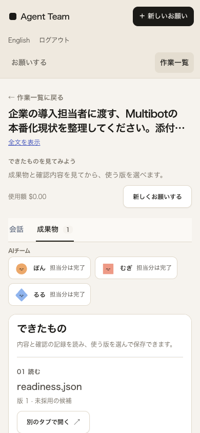
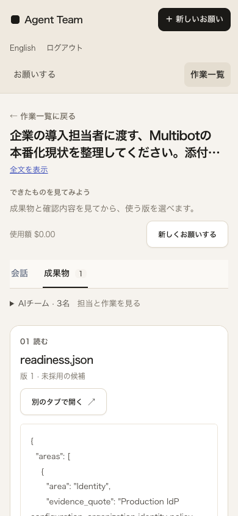
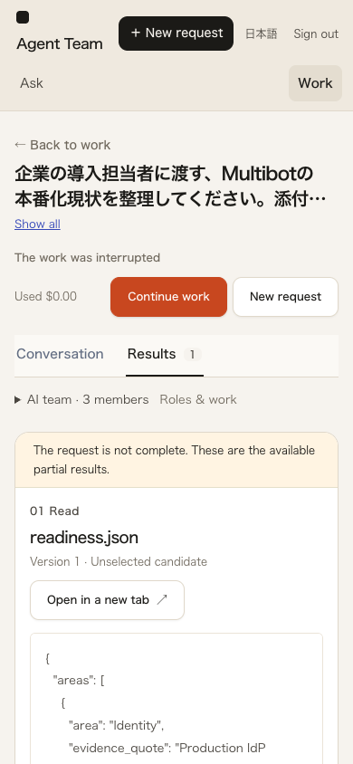

# 小画面で成果物を読み始めるまでの改善

2026-10-02。実v62の記録を新しい私有SQLiteへ取り込み、同じ未採用の成果物・同じ幅・先頭スクロール位置で変更前後を確認した。**一般業務品質・人間受入・受賞水準・一般公開・L3は未達のまま。** 完成例を含む旧v62の文面を新しい生成結果として扱わない。

## 欠点と変更

終了した依頼でも、本文より前にチーム3枚、一般説明、読む見出しが並び、320/390幅の初期画面から本文が外れていた。終了・成果物あり・成果物表示・承認待ちなしの場合だけ、実担当者の一覧をnative disclosureへまとめた。会話と成果物は常時mountしたまま、担当者の詳細と開閉の選択を保持する。会話表示や進行中・承認待ちはこの折畳みの対象ではない。

一般的な「できたもの」見出しと説明を除き、実ファイル名をh2にした。版、未採用/採用、原文表示・別タブ、版に紐づく確認記録、採用、保存の順序は維持する。未完了の警告・未確認採用・費用・再開条件・閲覧権限・旧AI解釈の区別も維持する。

単一ファイルを採用しても「ほかのファイルも」と案内していた文言は、実際の成果物IDと採用IDの集合差を使う。別revisionを既に採用したファイルを、ファイル全体が未採用であるかのように数えない。

## 同条件の実画面

基準commitは `983be97291d1252b0873d200136dbd8eb9110eee`。変更後は未commitの差分を含む [source manifest](after-r1-source.json) と配信bundleを測定した。基準commitだけを変更後の測定対象と誤認しない。

日英×320/390/768/1440幅×実rep3 completed・rep2 failed・rep9 interruptedの24条件を、前後それぞれ実Chromeで撮影した。viewport高844px、scrollY=0。24条件で横overflowとpage errorは観測しなかった。[前](baseline/report.json) / [後](after-r1/report.json) / [対照](comparison.json)。

| 同じ未採用rep3 | 本文枠の上端・前 | 後 |
| --- | ---: | ---: |
| 日本語390幅 | 858.98px | 693.39px |
| 日本語320幅 | 956.20px | 717.02px |
| 英語390幅 | 926.20px | 687.02px |

前回の採用済み画像とは状態が違うため、今回は新しい未採用DBの前後だけを比較した。文字サイズを下げて短縮していない。原文がJSONであることや、その内容の誤りも変更していない。

## 独立確認と制約

[変更前の画像批評](baseline-critique.md) / [静的境界確認](static-boundaries-983be97.json)。実装担当と独立担当が実画面と操作を確認する。AIによる独立評価は人間の初見利用試験ではない。

独立担当はr1のUIでTab/Enter/Space、閉じたチーム内部のTab除外、5秒の実pollをまたぐ開閉維持、会話往復、修正指示・会話検索・編集コピーの入力保持、閲覧権限を確認した。実rep3への採用POSTは1回だけ。実DBのseq56と監査HTTP202を確認し、再読み込み後の選択とZIPの全entry・原bytes/SHAを照合した。[操作集約](independent-interaction-summary.json) / [ZIP・不変確認](zip-and-invariants.json)。APIのactor_kind=humanも、今回のAI操作を人間受入に変換しない。

検証側の誤期待も保全した。[r1](quality-review-r1-retained.json) は縦scrollbarのある実ChromeでinnerWidth390/clientWidth375/scrollWidth375を横overflowと誤判定、[r2](quality-review-r2.json) は採用HTTP200を期待して実202の後に停止、[r3](quality-review-r3-readonly.json) はselection DTO自身にSHAがあると誤期待した。実際にはselectionのseq/event_idから採用イベントのSHAへ対応する。[r4](quality-review-r4-readonly.json) は採用済み状態から残る読取りとZIPだけを検証した。採用を巻き戻したり再送したりしていない。原202応答本文と採用直後のfocusは未保存・未確認である。

別担当の実200%画面では、既にメニューに一部隠れたsummaryへプログラムからfocusすると、Chromeが自動スクロールせず上20.69pxが隠れる経路を観測した。Shift+Tab→Enterだけの経路では再現せず、Enterやscroll anchoringが原因とは扱わない。r2ではfocus時の実メニュー/summaryの矩形が重なる場合だけ位置を補正する。横に並ぶデスクトップのメニューは対象にしない。最終ソースは [after-r2-source.json](after-r2-source.json)、全24条件の撮影は [after-r2/report.json](after-r2/report.json)。この撮影のrep3は前の操作で**採用済み**なので、未採用の短縮量へ混ぜない。

修正後の[独立r6](browser-critique-r6.json)では、同じ経路のsummary上端がfocus前86.31→focus後114.81px、メニュー下端107pxとなり、Enter後も欠けなかった。実Shift+Tabの経路は181.31pxで維持、390/320幅の前向きTabでも欠けなし。outerWidth1440/innerWidth720/DPR2、root/body zoom1の実Chrome200%であり、CSS zoomだけの代用ではない。[画像](native200-open-after-enter.png)。API応答43件は初回未ログイン401以外エラー0、writeはlogin2件のみ、元DB/source不変、所有Chrome20プロセスは残留0。[終了記録](browser-cleanup-r6.json)。

ブラウザー担当の[r1失敗](browser-critique-r1.json)は通常の未ログイン401を誤ってHTTP障害へ数えた検査側の問題。[r2](browser-critique-r2.json)は機能確認、[r3](browser-critique-r3.json)/[r4](browser-critique-r4.json)は通常キー経路での非再現、[r5](browser-critique-r5.json)はprogrammatic focus経路の再現として分けた。証拠保存先を2担当が一時共有した失敗も私有記録に保全し、以後exclusiveな別rootへ分離した。担当同士の照合では同名画像の上書きはなかったが、品質担当r1の共有root画像は公開根拠から除いている。

元生成物を修正せず、新推論・再開を実行しない。複数ファイル・複数revision・成果物なし終端・進行中の実記録による今回の確認は未実施。実Safari/iPhone、読み上げ、第三者の自力利用、公開配信性能も未確認。

最終の[独立画面批評](independent-visual-review.json)では、この観測範囲の追加blocking指摘はなかった。共有ナビの小画面での占有や、ログイン・進行・問題/再接続の体験は改善を続ける。[最終終了確認](cleanup.json)では元v62全49記録と元SQLite不変、全run状態と採用以外のevent不変、追加model/job0、実採用はrep3 seq56の1件のみ、所有API停止・port閉鎖・root撮影Chrome残留0、privateサービスstderrは全3回0 bytesを確認した。別担当のChrome終了は各独立報告に記録している。

## 継続確認

新しいCIの `check_result_reading.py` / `result-reading.mjs` は、repo内に保存された実v62のrep3/2/9を別SQLiteへ取り込み、実operator/viewerとChromeを使う。run・全events・artifact bytesを保全し、元SQLiteがないCIではtask行を不完全なcheckpointから再構成しない。この制約を明記し、今回の私有検証（元SQLiteの実task/message/approval/checkpointもコピー）と同一の完全再現とは呼ばない。

実本文のSHA、結果優先、filename h2、チームの開閉・実poll・会話往復、未完了警告、権限、戻り先、横overflowを確認する。CIは採用/ZIPを操作せず、許容するwriteは実ログインだけ。業務状態・モデル・job・原資料・実配信bundleの不変と所有資源終了を確認し、safe-reportだけをuploadする。

前変更983be97の [CI36924961174](https://github.com/FORIFOR/Multibot/actions/runs/36924961174) / [OIDC36924961130](https://github.com/FORIFOR/Multibot/actions/runs/36924961130) のsafe artifact照合を [prior-ci-983be97.json](prior-ci-983be97.json) に収録した。今回のUI変更をその過去CIで検証済みとは扱わない。

新runnerの原失敗も別記録として保持する。negative-r1は存在しないpackage-lockを参照して安全な報告の初期化前に失敗したため、原tracebackは保存できず、私有noteだけが残る。negative-r2/r3/r4は実在する不適合なdocs/qualityを入力し、開始前FAILと未実施nullを確認した。r1は実adminの初期発行要件を満たさずprovisionでFAIL。r2は12ケース中9通過・3件の本文SHA判定でFAILしたが、その時点の本文SHAが脚本に記録されていないため原因は確定しない。これらを製品品質の成功件数に加えない。

独立レビューで「preが見えるだけではLoading…でも合格する」とのP2を受け、同じDOMスナップショットからUTF-8 SHAを取り、原成果物と一致するまで10秒以内で待つようにした。後続r3では実際に日本語18bytes/英語10bytesのloadingから5152bytesの原本文へ遷移した。ただし、3runの原本文SHAは同一なので前run本文との識別はこの資料ではできない。r2の原因を後続のloading観測だけで断定しない。[最終静的レビュー](ci-independent-static-review.json)。

実LLMの次系列は未開始のまま。[資源の読取り記録](resource-observation.json)では回収可能推定4,790,009,856 bytesが既存運用閾値8,741,958,113 bytes未満で、モデル非resident・推論0・旧STOP維持を確認した。free%を追加ロード余裕と扱わず、閾値低下や無関係アプリ停止はしない。この拒否は実機で推論不能という実証ではない。新UIを固定済み983be97の試験条件へ混ぜない。

最終[local r4](ci-reading-r4.json)は実operator日本語/viewer英語×320/390×3状態の12ケース・144項目を通過した。原資料・業務snapshot・配信bundleと検証sourceのhash不変、追加model/job0、想定外HTTP/console/network0、private runtime error0、API停止/port閉鎖、所有Chrome19件の残留0を確認した。これは操作の回帰範囲であり、業務品質や包括的アクセシビリティの合否ではない。Python全体150秒・子browser120秒と、外側CI step5分を区別し、終了処理の余裕を確保する。
