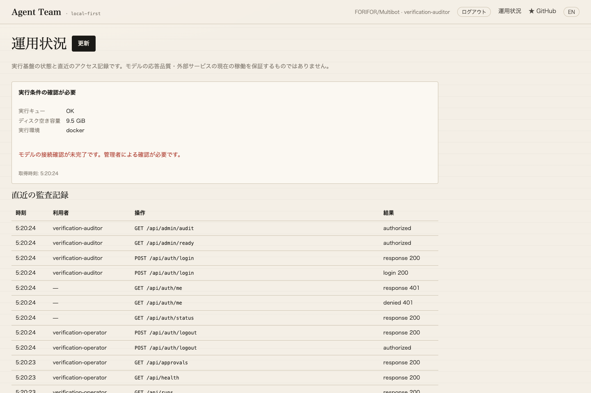

# Operations verification — 2026-09-14

The [recorded HTTP drill](observer-drill.json) uses a real Uvicorn listening socket, real issued/rotated keys, separate SQLite stores and saved real-model work. No network response, identity, model response or store is mocked.

- Auditor permissions admit operational metadata and refuse workspace reads, exports, settings and mutations, including an accidentally assigned run grant.
- The separate collector retains its cursor/records across real server shutdown and restart, reports the outage, clears stale metrics and records recovery.
- Revoking the actual collector key causes an authentication failure. The newly issued key restores collection.
- Actual snapshot restore changes the server stream ID. Both histories remain in the collector, with an explicit source-change alert.
- A loopback backend can be monitored while preserving its configured HTTPS public Host. No public TLS/certificate claim follows from that loopback check.

[Backend results](backend-tests.xml): **95 passed**. The pre-existing suite includes scripted-provider tests; these three added operations tests use actual services and recorded work. The health drill reuses the original passed local-model capability record and does not call a model or claim current model health/business success.

[Browser results](browser-result.json): **5 checks passed**, zero page errors. Real admin, operator and auditor credentials were used. The deliberately unprobed staging installation visibly reports missing prerequisites. The mobile check verifies no page-width overflow; screenshots show the actual operations screen.

An initial browser attempt encountered a pre-existing listener on port 8799 before login. The new verification API failed to bind; no credentials were submitted there. The check was rerun against its own newly allocated loopback port. The existing listener was left untouched.

The supplied Linux systemd supervision unit was not installed or exercised on this macOS host. Independent off-site custody, real alert routing, a supported production IdP/TLS deployment and agreed service objectives remain unverified. No customer message or external alert was sent.

