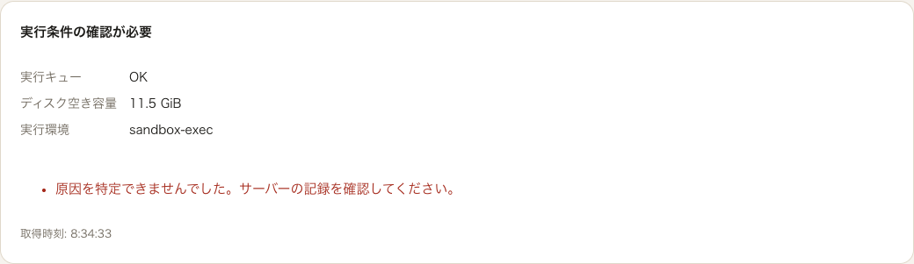
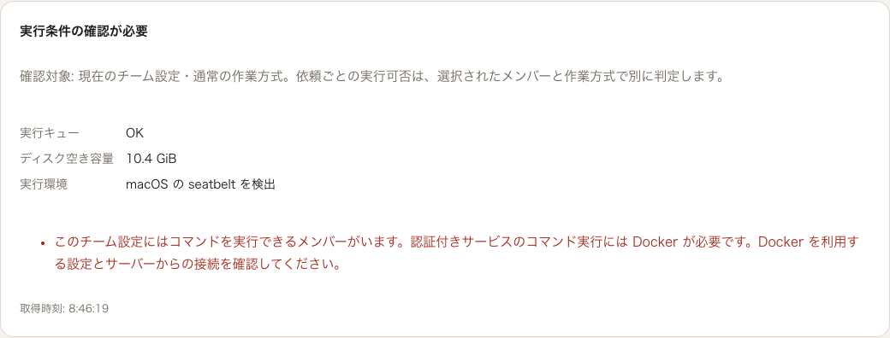

# Operations の準備状況表示の照合

実 API が `503 / sandbox-exec` を返したとき、画面に内部名と「原因を特定できませんでした」が出る不具合を、保存済みの実設定・実 SQLite・実 HTTP・Chrome で確認し、表示を修正した記録です。本番利用の受入、モデルの品質、人間による受入の合格ではありません。

基準 HEAD は `b0689dcfbd29a2a6d778166dc7280946048e1e10`。修正後は未コミット差分を含むため、`build-r2.json` のソース・配布ファイル SHA を検証対象とします。変更は `Operations.tsx` と `App.tsx` の `secured` 引数受け渡しです。統合ビルドには別担当の画面変更も含まれます。

## 原因と変更

`runtime/sandbox.py:84` が返す macOS の名前は `sandbox-exec` ですが、旧画面の辞書は `seatbelt` でした。さらに `api/app.py:210` は、認証付きサービスのコマンド実行では Docker を要求します。旧画面の理由判定は `none / subprocess` のみで、この拒否を説明できませんでした。受付側の 503 自体は正当です。

実バックエンド名に合わせ、認証状態は既存 AuthGate から渡します。認証付きサービスで Docker が必要な構成には、その要件と設定・接続の確認を案内します。local モードの seatbelt まで拒否する説明にはしません。応答の `workflow` を使って判定対象を示し、個別依頼は選択メンバー・作業方式で別に判定されることを記します。`not_required` も「コマンド実行なし」に改めました。

停止中フラグは readiness DTO に含まれないため、未報告の原因に対する unknown fallback は残しています。サーバーの受付、Gateway、`require_container`、Docker 選択の実装は変更していません。

## 実測

全条件で同一の実記録 `docs/evidence/real-readiness-v61-qwen35-fixed-20260925/01-run_1a0d74b88812173eb2c-run.json` の `config_snapshot.config_yaml` を使用しました。新しい私有ディレクトリ・SQLite・実発行キーを用意し、`check_public_service.running_browser_api` と所有 Chrome の終了処理を再利用しています。架空の依頼・run・応答は作っていません。

| 条件 | 実 readiness | 日本語・英語の画面 |
|---|---|---|
| 修正前・認証あり / auto | 503、sandbox-exec | 内部名と unknown 理由を再現（表示 FAIL） |
| 修正後・認証あり / auto | 503、sandbox-exec | seatbelt 検出と、認証付きコマンドに必要な Docker を説明 |
| 修正後・local / auto | 200、sandbox-exec | 準備済み。Docker 必須の案内を出さない |
| 修正後・認証あり / docker 明示 | 503、none | 実 Docker daemon に接続できず、Docker の設定・接続確認を案内 |

各条件で default / `workflow=team` / `workflow=document` の実 GET を保存し、画面は default 応答を使っています。この元設定には **document でもコマンドを使える非 reviewer の builder が残る**ため、認証ありの document が 503 になるのも正当です。ファイル検査だけを行う document reviewer の構成まで Docker 必須とはしていません。

修正後は 3 条件・明示 GET 9 件・実 Chrome 日英 6 ケースが完了しました。実 API 3 件は task・ロック・port の終了と lifespan エラーなしを確認。Chrome の追跡対象 37 件は残留 0、終了シグナル送信 0 でした。修正前を含む 4 DB で runs / jobs / model.called はすべて 0、原資料・対象ソースの前後 SHA も一致しています。`verification-summary.json` と各条件の JSON に範囲を分けて記録しました。

## 保全した失敗と制約

- 初回の私有検証スクリプトは誤った import により `ModuleNotFoundError` で、サービス開始前に失敗しました。`initial-start-failure.json` と原スクリプト・原ログの SHA を保持しています。修正前の表示不具合を修正後の成功で置き換えていません。
- Chrome は修正前 `154.0.8037.58`、修正後 `154.0.8037.93` でした。同一ブラウザ版を固定した画像比較とは主張しません。画面の条件・実応答・各版を記録しています。
- GET と実 UI は同じ所有 API に対して逐次確認しました。HTTP クライアントの原応答は保存していますが、ブラウザ個々の応答本文は別途捕捉していません。
- `not_required`、停止中、未知バックエンド、低ディスクなどは今回の実構成では発生していません。コード読取の確認と区別します。モックで埋めていません。
- VM・コンテナ・コマンド・モデルを実行していません。Docker 成功経路や現在のモデル接続を証明する試験ではありません。実設定に残る過去の接続確認も、現在の疎通として扱いません。
- 公開 JSON は許可した集計・状態・SHA の投影です。生の HTTP 応答、監査行、秘密鍵、DB、所有プロセスのコマンド、traceback、ログは私有領域に保持します。画像も実 readiness カード部分だけです。

`manifest.json` はこの公開記録のファイル SHA とサイズを列挙します。判定者は AI であり、独立した人間の受入を代替しません。
