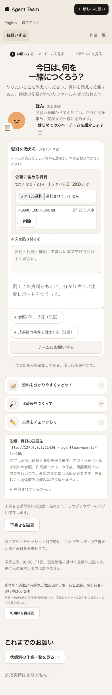
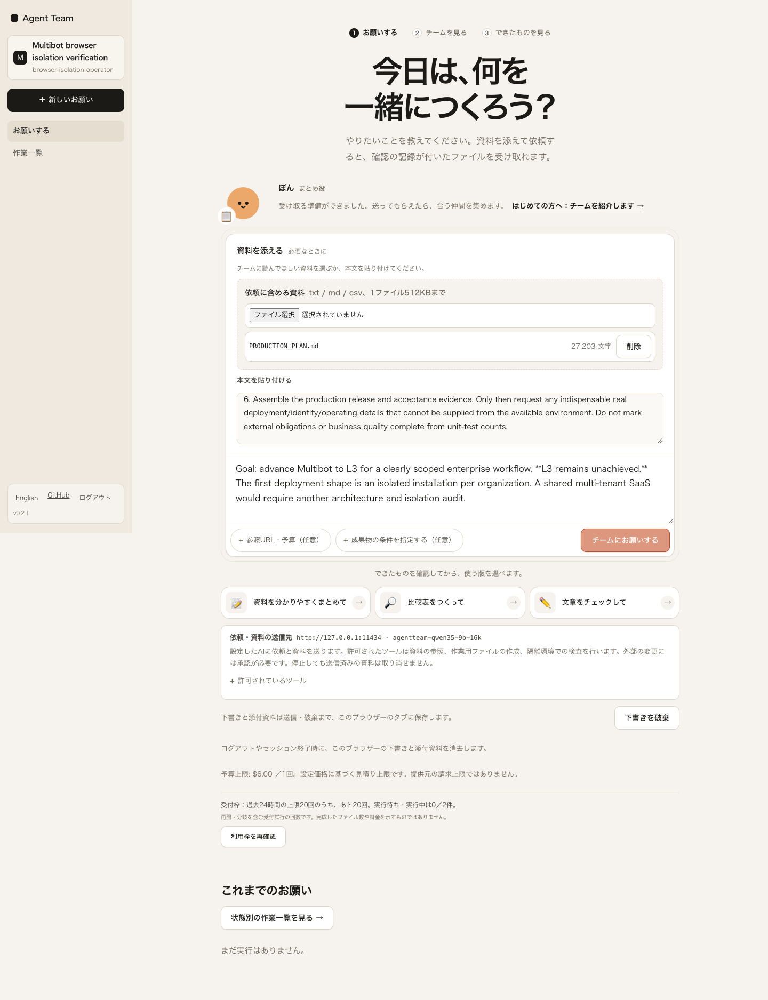
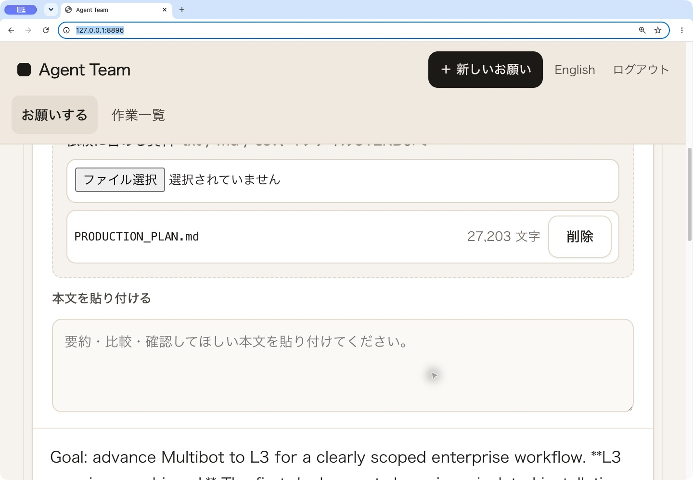
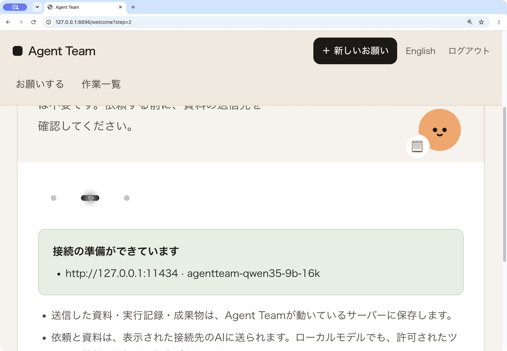

# Browser account boundary and reload-safe retry — 2026-10-02 JST

This is implementation verification with real Chrome, real installation access keys, real HTTP, and real SQLite. It does **not** establish public-service readiness, real IdP acceptance, end-user usability, or LLM business quality. No model request was made and no response, customer document, or provider was mocked.

## Contract and change

Same-principal reload retains an unfinished request and attached repository material. Sign-out, an actual HTTP 401, or a change of organization, identity source, subject, or role clears request drafts, attachments, welcome draft text, list-search text, local artifact copies, and pending command memory/storage. Other open tabs close their old workspace. Login state is rechecked on returning to a visible tab; IdP-return identity changes notify other tabs. The authenticated subtree is keyed to the principal. A late API response from an earlier session cannot repopulate a newer session.

Concurrent key sign-ins announce the mutation before sending it. Both stale-success and stale-failure paths close local and peer workspaces, because receiving Set-Cookie can precede reading the response body. Per-tab sequence numbers discard duplicate/out-of-order storage/channel notices; pending notices from different tabs are tracked separately. Auth status, identity, login and logout calls have 15-second deadlines.

Authenticated API calls carry the browser-bound subject; the backend rejects a mismatched shared cookie with HTTP 401 before authorization/mutation. Browser-native downloads and EventSource use an optional subject query instead. The subject is not a credential or grant: normal authentication/RBAC still apply. Avoid publishing these subject-bearing URLs in logs or notifications.

Sign-out hides private work immediately and prevents a new sign-in until the sign-out request finishes, including in other tabs. A failed server sign-out stays on the login screen and explicitly reports that server invalidation was not confirmed. A transient auth-status connection error hides the workspace while preserving the same principal's stored draft for recovery.

A pending idempotent command now stores only its SHA-256 body signature and generated idempotency key in tab-scoped storage. The unchanged command reuses its key after reload. An actual definitive response clears it, so a later deliberate identical request gets a new key. Unavailable/unreadable command storage blocks submission rather than issuing a fresh unsafe key. A changed payload after an unknown result still requires outcome review; this change does not establish exactly-once external side effects.

## Evidence

- `results.json`: 7 checks for reload, logout, next principal, other-tab logout/login, real session revocation/401, and no added runs. Input: this repository's `docs/PRODUCTION_PLAN.md`. Artifact-storage cleanup uses the preserved v61 artifact metadata and bytes; v61's content is not treated as accepted business output. Editing-copy cleanup is checked at the storage boundary, not claimed as editor UI coverage.
- `retry-reload.json`: Chrome CDP intentionally terminates a real `/api/runs` response after the server has handled it. After reload, retry uses the same key and replays the saved receipt without another run. A subsequent explicit new request creates one new run. The server's `start:false` flag ensures there are no execution jobs. The final fixed-code run uses the copied real probed configuration and receives HTTP 202 with `start:false`; this is an admission receipt, not successful model work. Earlier HTTP 409 configuration-blocked receipt evidence is retained separately in `initial-retry-409.json`.
- `parallel-login.json`: two actual successful login requests are held at Chrome response stage and released in sequence. A second case interrupts the later actual HTTP 200 with ConnectionReset, exercising the stale catch path. Both tabs stay closed and can sign in again. A separate actual cookie switch without browser notices proves that the old draft mutation carries the prior subject and is rejected with HTTP 401; no run is created. Response-stage interruption does not prove a timeout or a JSON-body-only cutoff after the browser has applied headers; those exact transport timings remain unverified.
- `viewport-checks.json` and the four PNGs: real operator first screen and repository-document attachment at 390/768/1440 CSS pixels; Chrome native 200% shows the form and destination within the window. Independent reviewer/root inspected these captures. This is implementation usability inspection, not unassisted third-party onboarding acceptance. `native-window-200.json` records devicePixelRatio 2. The known cropped Playwright fullPage 200% captures remain local and are excluded.
- `manifest.json`: revision, tracked-diff hash, scoped source hashes, environment, and successful build command. Source edits after these identifiers require related revalidation.
- Local screenshots and interim failure logs remain under `artifacts/product-quality/browser-isolation/`. The observed sign-out/relogin race was fixed and rechecked; failure files were not relabeled as success.

## Reproduce

Use a dedicated loopback installation only. Issue two real credentials with `agentteam access`: one `admin`, one `operator`, bound to that installation's exact loopback origin. Build and serve the current UI. The scripts read keys from private files and never print them. `auth-browser-isolation.mjs` deletes that verification installation's browser-session rows to exercise real revocation; do not point it at another installation.

Set `AUTH_TEST_URL`, `AUTH_TEST_ADMIN_KEY_FILE`, `AUTH_TEST_OPERATOR_KEY_FILE`, `AUTH_TEST_DATA_DIR`, and `AUTH_TEST_EVIDENCE_DIR`, then run:

```sh
node frontend/scripts/auth-browser-isolation.mjs
node frontend/scripts/auth-retry-reload.mjs
node frontend/scripts/auth-parallel-login.mjs
```

The second script invokes the API exported by the actual built bundle, not a substitute client. It tests transport/receipt behavior with repository material and `start:false`. Requires installed Chrome, the frontend's existing Playwright dependency, and `sqlite3`.

Browser storage is not a security boundary against someone who controls the same OS/browser profile or uses developer tools. Server RBAC remains the authority. Deployment, TLS/IdP, load, operating ownership, and business acceptance remain separate unmet requirements.

## Remaining boundaries

If a peer tab is terminated immediately after its pending sign-in/sign-out notice, it cannot send completion. Remaining tabs keep the old workspace closed and require reload to recover. Normal HTTP error/timeout completion broadcasts recover the sign-in screen. Browser-process termination recovery has not been accepted.

The initial `failure.json/png` records are kept locally rather than overwritten. A parallel-test harness attempt omitted the real Origin header and received the server's CSRF 403; its timestamped failure files remain preserved. The corrected explicit loopback Origin then passed the subject-mismatch check.








