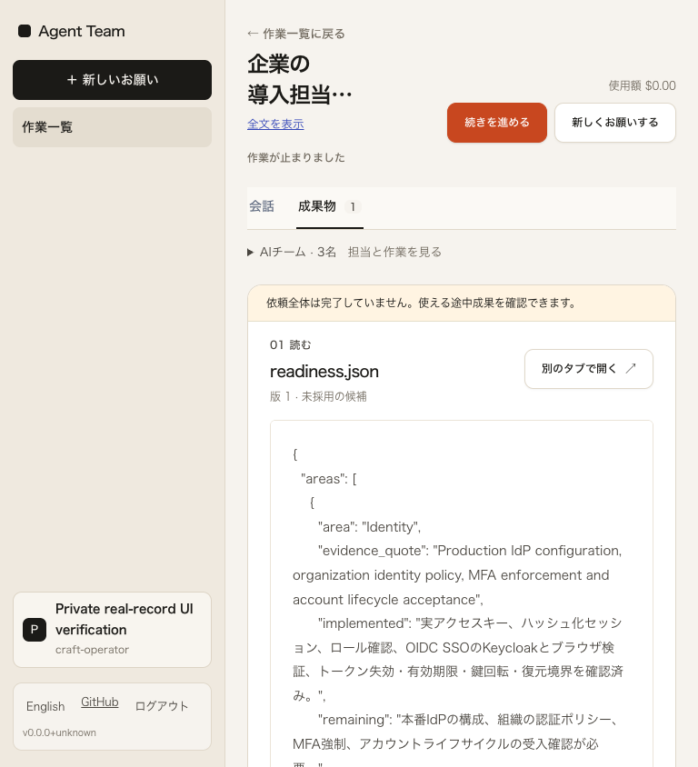
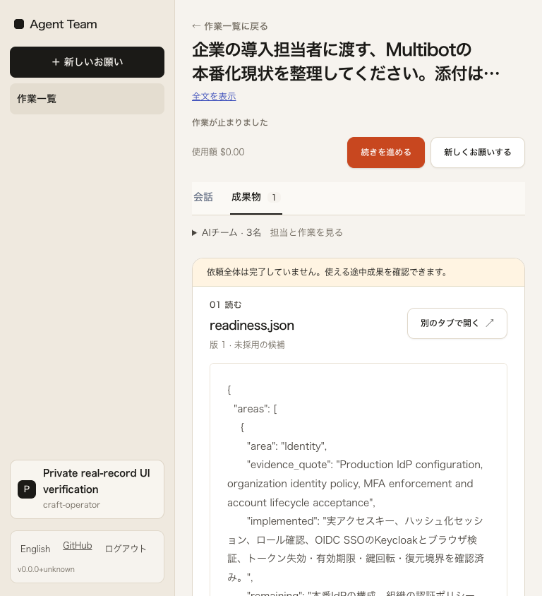
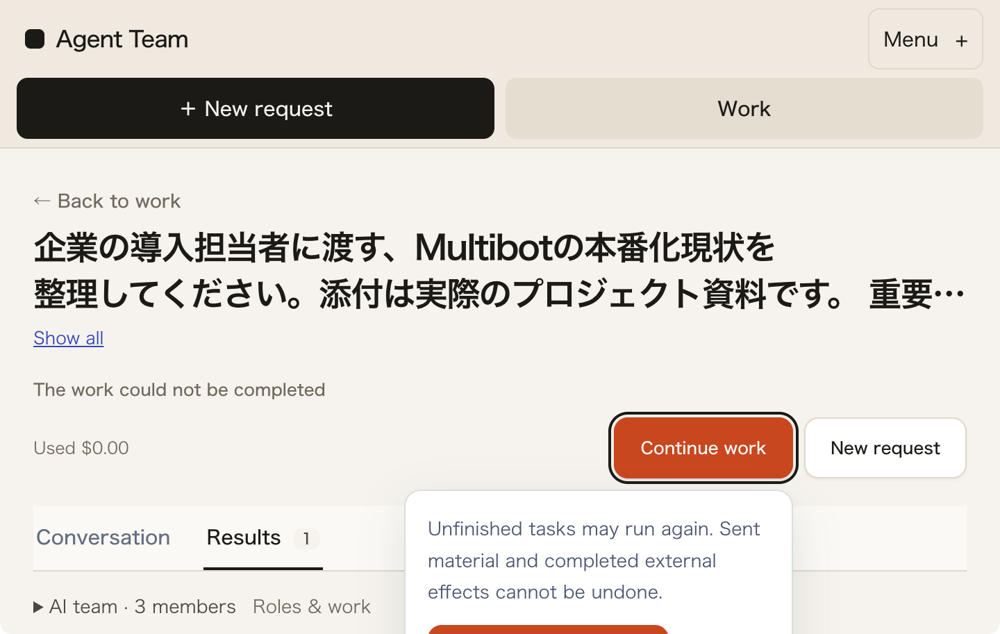
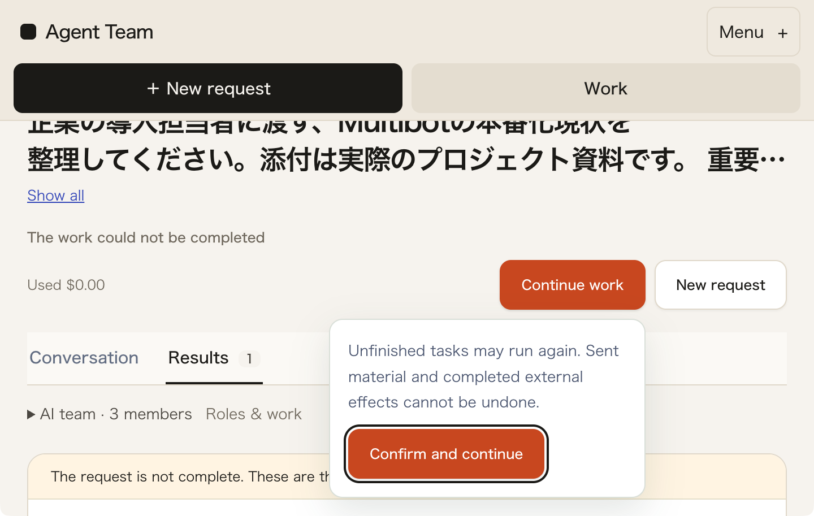

# 中間幅の依頼見出しと再開前の注意書き

2026-10-02。[品質目標](../../design/AWARD_QUALITY.md)に沿う、実記録の読取り画面の反復。**一般公開サービス・受賞水準・L3・人間受入・一般業務品質は未達。** 保存済みv62を私有SQLiteへ取り込んだ実HTTP/Chromeによる確認で、新しい文書生成は行っていない。

## 同じ記録で見える問題を直す

基準は `b0689dcfbd29a2a6d778166dc7280946048e1e10`。サイドバーのある768幅で、失敗/中断した依頼の見出しが再開操作と同じ行を分け合い、日本語118.02px・英語121.34pxに押し込まれていた。操作より前に依頼と状態を全幅で読む構成を1100幅まで広げ、費用と操作を次の行へ移した。文字サイズ、全文表示、未完了の警告、原成果物、採用/版/レビュー、実際の再開条件は維持した。

同じ実記録・日英768/820/1024幅で、見出し幅はそれぞれ472/524/728pxになった。320/390/1101/1440幅の既存主要矩形は前後一致した。日英とcompleted/failed/interrupted、breakpoint両側、Chromeの実200%を含む52画面を前/r1/r2で保存した。52は条件数であり品質点数ではない。768幅の失敗画面では本文開始が約52px下がるため、縦方向の短縮とは呼ばない。読み取れる依頼名を優先した変更である。

実測対象は未commit差分を含む [r1](build-r1.json) / [最終r2](build-r2.json) のソース・配布bundleのhashで固定した。基準commitだけを変更後の測定対象としない。初期の[静的レビュー](static-review.json)はr1のCSSが対象で、r2の動作確認の代わりではない。

## 実200%で見つかったr1の欠点を再修正

r1では実Chrome200%（outer1440 / inner720×456 / DPR2 / root・body zoom1）で再開の注意書きを開くと、panel下端510.94px、確認button下端493.94pxが画面外へ出た。Tabで部分的に戻せ、PageDown/UpとShiftTabでも操作できるため「操作不能」とは断定しない。ただし確認ボタンとfocus輪郭が見切れるため、r1をFAILとして保全した。

r2はnative detailsを開いた時だけpanelの下端を測り、viewport内の16px余白を越える場合に末尾までスクロールする。閉じる時や既に収まる時はスクロールしない。自動的な再開、採用、依頼送信は加えていない。

同じ条件のr2はscrollY70.5px、summary上端230.19px（sticky下端107px）、panel下端440.44px、確認button下端423.44pxとなり、注意書き・確認button・focus輪郭を実画像で確認できた。Tab、ShiftTab、閉じる/再展開、実GET200のpollでも位置を維持した。他17の開閉条件はscrollY0のまま。スクロールによって依頼見出し上部がstickyの後ろへ移るため、全内容が同時に画面内へ収まるとは主張しない。

[別担当の実画面批評](browser-independent/independent-review.json)と[最終比較](browser-independent/r2-comparison.json)を保持し、実装担当も前後とfocus画像を直接閲覧した。AIの独立批評は初見の人間による受入ではない。再開の確認ボタンは押しておらず、外部作用や再開成功をこの試験で検証した扱いにしない。

## 記録・制約

前/r1本撮影のChromeは154.0.8037.58、r2は154.0.8037.93であり、全52条件を同一ブラウザー版に固定した比較とは呼ばない。r1の見切れ追加試行とr2のfocus確認は同じ .93 で実施している。さらに[同 .93 の旧bundle補足対照](browser-environment-control/review.json)でJA768の見出し118.02px、native720の旧panel下端429.72pxが元 .58 の矩形と一致した。これは2条件だけの対照であり、全52条件の環境固定を代替しない。

[原r1の失敗](browser-independent/r1-comparison.json)、スクロール静止前に矩形を採取した試行、静止を待った別試行を保持する。PageDown/Upの判断には後者を使用する。極端に長い原依頼の「全文表示」で展開高さが数万pxになる点は前後共通だった。修正後にCollapseのfocusが画面外へ移る所見を観測したが、基準版のfocus位置は未測定のため、新規/既存の不具合と断定しない。DOMと視覚上のタイトル/状態/操作順が異なる点も既存であり、Tab順まで整理したとは主張しない。

私有原記録は `~/.cache/agentteam-bench/tablet-reading-independent-20261002-r1`、build/公開候補は `~/.cache/agentteam-bench/tablet-reading-craft-20261002` に保持する。公開は安全な限定JSONと代表画像だけとし、実鍵・DB・原ログは含めない。原資料/業務記録の不変、追加model/job/採用0は[独立照合](browser-independent/invariants.json)、所有API/Chromeの終了は[終了記録](browser-independent/cleanup.json)へ分ける。補足対照の最後の終了は[別記録](browser-environment-control/cleanup.json)で確認した。過去のmodel.called222件は保存されたv62の履歴であり今回の生成数ではない。

[前headのCI証拠](prior-ci-b0689dc/manifest.json)はCI36937881229/OIDC36937881117の安全な原artifactと独立照合を保持する。実行merge fc7d41995a25ea958735a5e205d3f153e2c28ffdとPR headを区別する。前の成功を今回変更のCI成功へ読み替えない。

[今回の読取り資源確認](resource-observation.json)では回収可能推定5,548,605,440 bytesが固定開始閾値8,741,958,113 bytes未満だった。固定983be97の完成例なし10回系列は推論0のまま。モデルのload/unload、無関係アプリ停止、基準引下げで通していない。実機推論不能を実証したものではない。所有サービス終了後の[最後の確認](resource-after-cleanup.json)では、回収可能推定5,100,552,192 bytesと空きディスク10,281,390,080 bytes（9.575 GiB）が、固定のメモリ基準とディスク>10 GiB基準をともに満たさなかった。固定条件・原記録を保持し、起動していない。

同時に[運用状態の実応答と説明](../operations-readiness-craft-20261002/README.md)を照合した。[初回接続失敗の観察](../auth-initial-recovery-observation-20261002/README.md)は未修正候補の証拠として分けて保持する。実Safari/iPhone・仮想keyboard・読み上げ・初見第三者・実公開配信、実進行状態や複数版の確認は残る。公開先、実登録/IdP、費用と運用責任、実資料業務の品質を未受入のまま完成扱いにしない。
